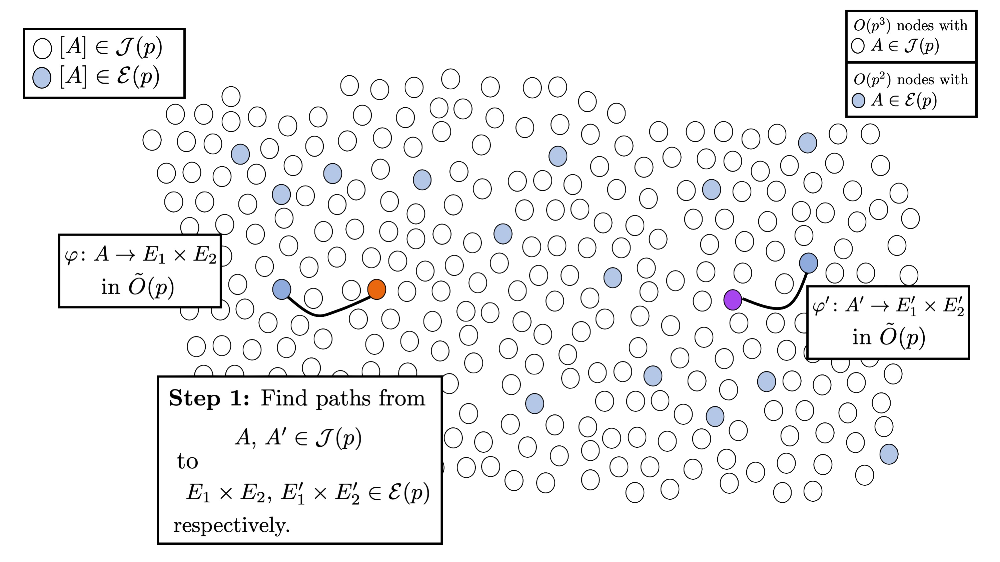
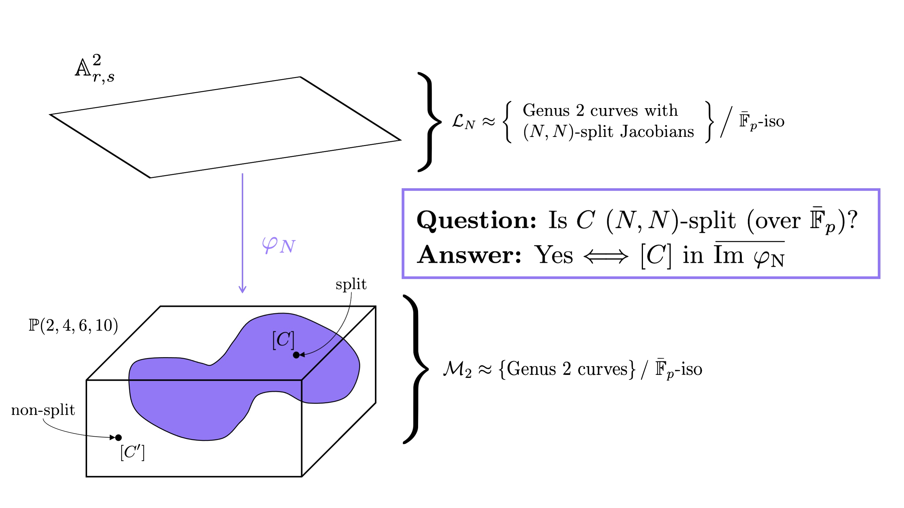
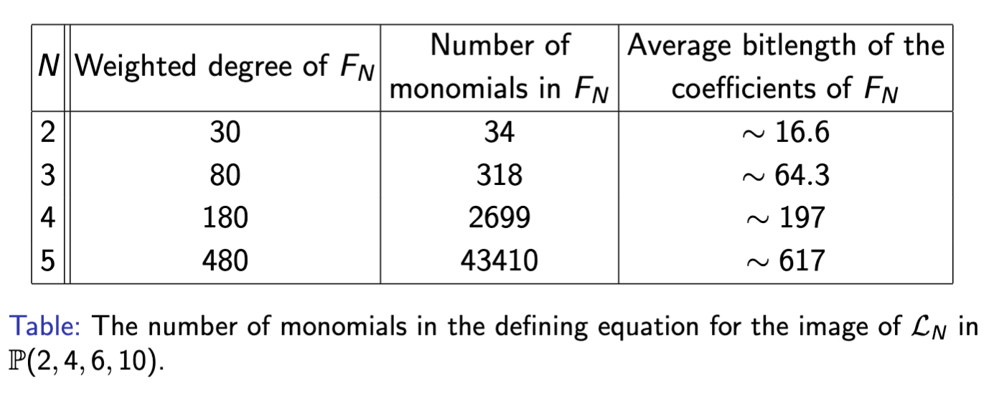
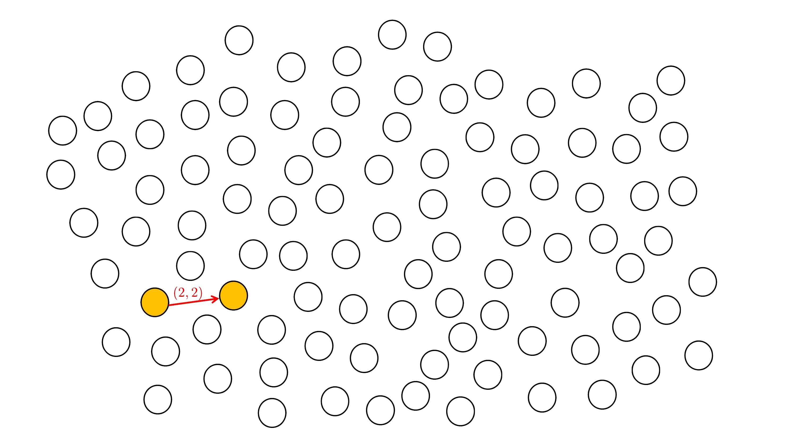
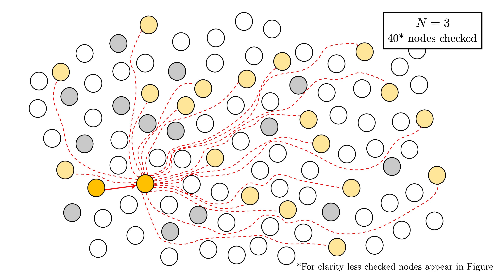

In this blogpost, I'll give an overview of our new paper *An algorithm for efficient detection of $(N,N)$-splittings and its application to the isogeny problem in dimension 2* ([link](https://eprint.iacr.org/2022/1736)), with associated code available [here](https://github.com/mariascrs/SplitSearcher). This is joint work with Craig Costello and Sam Frengley.

In this paper, we revisit the general superspecial isogeny problem in dimension 2, which asks an adversary to find an isogeny $$\phi: \text{Jac}(C) \rightarrow \text{Jac}(C'),$$ where $C$ and $C'$ are genus $2$ curves with superspecial Jacobians. The best known algorithm for solving this problem is due to Costello and Smith [5].
The general superspecial isogeny problem underlies the security of various isogeny-based protocols in two dimensions, such as the dimension 2 analogue of the CGL hash function [3], which was proposed by Takashima [15] and later extended by Castryck, Decru and Smith [2]. 
As we are studying the general problem, we do not assume any knowledge of the degree of the isogeny or any (SIDH-like) torsion point information. Indeed, the superspecial isogeny problem *with* torsion point information can be solved in polynomial time [11], thus making primitives such as the dimension 2 analogue of SIDH, G2SIDH [8], insecure.

# Some background on dimension 2 abelian varieties

## Superspecial abelian surfaces

To generalise elliptic curves to higher dimensions, we want to think of elliptic curves as *one-dimensional (principally polarised) abelian varieties*. In this paper, we are concerned with *two*-dimensional (principally polarised) abelian varieties, more commonly referred to as (principally polarised) abelian *surfaces*.

In isogeny-based cryptography, we usually consider *supersingular* elliptic curves. Supersingularity has a variety of equivalent definitions. Two of these are:
* The trace $t$ of Frobenius satisfies $t \equiv 0 \bmod p$ $(p > 3)$
* The Newton polygon is a straight line segment with slope $1/2$.

In dimension $>1$, however, these become distinct. The first property is called *superspeciality* and the second is *supersingularity*. Unfortunately (and rather confusingly), the correct generalisation of a supersingular elliptic curve over $\bar{\mathbb{F}}$$p$ is a superspecial abelian surface over $\bar{\mathbb{F}}$$p$. 

There are two types of abelian surfaces:
* Products of elliptic curves $E \times E'$. If the abelian surface is superspecial, the elliptic curves will be supersingular;
* Jacobians $\text{Jac}(C)$ of genus 2 curves $C$.

For dimension 1 isogeny-based cryptography, we usually only consider the elliptic curves up to $\bar{\mathbb{F}}$$p$-isomorphism and label these classes with the $j$-invariant. The same is true for dimension 2 isogeny-based cryptography. In this case, we label the $\bar{\mathbb{F}}$$p$-isomorphism classes with the following invariants:
* Sets of $j$-invariants $\\{ j(E), j(E') \\}$ (note that this is a set as the ordering of $E$ and $E'$ does not matter for our purposes).
* Igusa-Clebsch invariants $I$$2$$(C)$, $I$$4$$(C)$, $I$$6$$(C)$, $I$$10$$(C)$. 

The Igusa-Clebsch invariants live in weighted projective space, and the subscript denotes the weight of the invariant.

> **Definition.** Let $\mathbb{A}$$n+1$ be $n$-dimensional affine space over $\bar{\mathbb{F}}$$p$. The *weighted projective space* $\mathbb{P}(w$$0$$, \dots, w$$n$$)$ is the set of equivalence classes of $\mathbb{A}$$n+1$$\backslash{0}$ under the equivalence relation $\sim$ defined $(a$$0$$: \dots : a$$n$) $ \sim (b$$0$$:  \dots : b$$n$) if and only if there exists $\lambda \in \bar{\mathbb{F}}$$p$ such that $(a$$0$$, \dots, a$$n$) $ =(\lambda$$w$$0$$b$$0$$, \dots, \lambda$$w$$n$$b$$n$$)$.

If we want to move these invariants to affine space (where we now have true equality, rather than equality up to some projective constant), we will have to normalise these invariants (taking into account the weight of each coordinate). There are infinitely many choices of normalisation, however some are more common or natural than others. A common choice is 
$$i_1 = \frac{6(I_2^2-16I_4)}{I_2^2}, \ i_2 = \frac{-12(5I_2^3 - 176I_2I_4 + 384I_6) }{I_2^3}, \ i_3 = \frac{3888I_{10}}{I_2^5}.$$ Note, however, that in our paper we deviate from this choice, the reason for which will be explained later. 

For superspecial abelian surfaces, these invariants lie in $\mathbb{F}$$p$$2$. Recall that the same holds for supersingular elliptic curves; one of reasons confirming that superspeciality is the correct generalisation.

## $(N,N)$-Isogenies

For isogeny-based cryptography, we not only need elliptic curves, but also *isogenies*. In particular, we consider $N$-isogenies $\phi: E \rightarrow E'$ with kernel $\mathbb{Z}/N\mathbb{Z}$, generated by a point $P \in E(\bar{\mathbb{F}}$$p$$)[N]$.

Moving to dimension 2, we consider $(N,N)$-isogenies.

> **Definition.** An $(N,N)$*-isogeny* is an isogeny (i.e., a surjective group homomorphism with finite kernel) $\phi: A \rightarrow A'$ between abelian surfaces $A$ and $A'$, where:
> * $\text{ker } \phi \cong (\mathbb{Z}/N\mathbb{Z})$$2$; and 
>* $\text{ker } \phi $ is maximal isotropic with respect to the $N$-Weil pairing, i.e., for all $P, Q \in \text{ker } \phi$, we have $e$$N$$(P, Q) = 1$. 

The second condition is there to ensure that $A'$ comes equipped with a principal polarisation. For $N$-isogenies, this is *always* satisfied, and therefore this condition is usually omitted from the definition. 

Let $D$$N$ be the number of $(N,N)$-isogenies from a superspecial surface $A$. Then we have that $D$$N$ $ = O(N$$3$$)$ (the exact number can be found in Section 2 of our paper). This is much larger than in the dimension 1 case where there are $O(N)$ outgoing isogenies from a supersingular elliptic curve. Here we are ignoring the rare, special cases where $j(E) = 0$ or $1728$, for example.

## Dimension 2 general isogeny problem

In its most general form, the superspecial isogeny problem in two dimensions asks to find an isogeny $$\phi: A \rightarrow A'$$ between two superspecial abelian surfaces $A/\mathbb{F}$$p$$2$ and $A'/\mathbb{F}$$p$$2$.

The general isogeny problem can be viewed as finding a path between two nodes in the superspecial isogeny graph. 

## Superspecial isogeny graph

Let $p$ be a large prime not dividing $N$.

> **Definition.** The superspecial isogeny graph, denoted $\Gamma(N; p)$, is the graph with vertex set $\mathcal{S}(p)$, defined as the set of isomorphism classes of superspecial abelian surfaces, and whose edges are $(N,N)$-isogenies over $\bar{\mathbb{F}}$$p$.

This graph has a number of nice properties:
* Firstly, the vertex set is finite. More precisely, we have that the size of $\mathcal{S}(p)$ is $O(p^3)$. This is only true when we restrict to *superspecial* surfaces, and mirrors the finiteness property of the vertex set in dimension 1.
* The isomorphism classes $[A] \in \mathcal{S}(p)$ are represented by surfaces defined over $\mathbb{F}$$p$$2$. Again, this property is only true by restricting to superspecial abelian surfaces, and matches the situation in genus 1. 
* The graph is $D$$N$-regular (except for on a small number of special nodes).

The hardness of the general isogeny problem in dimension one is largely based on the fact that the supersingular isogeny graph is Ramanujan, i.e., has optimal expansion. In contrast, $\Gamma(N; p)$ is not quite Ramanujan, but we can still argue that the expansion is good enough to build secure cryptographic protocols [7].

As we have two types of abelian surfaces, there is a natural partition of the vertex set. Indeed, $\mathcal{S}(p)$ is equal to the disjoint union of: 

* $\mathcal{J}(p) = \\{ [A] \in \mathcal{S}(p) : A \cong \text{Jac}(C) \\}, $ and 
* $\mathcal{E}(p) = \\{ [A] \in \mathcal{S}(p) : A \cong E \times E' \text{ with } E, E' \text{ supersingular ECs} \\}.$

There are around $O(p^3)$ nodes in $\mathcal{J}(p)$ and $O(p^2)$ nodes in $\mathcal{E}(p)$, making the latter the *rarer* case. 

We often fix the vertex set but consider multiple edge sets. We will therefore use $\Gamma(\mathcal{N}; p)$ to denote the graph with the vertex set $\mathcal{S}(p)$ and and whose edges are $(N,N)$-isogenies for all $N\in \mathcal{N}$. 

We can now view the general isogeny problem as a path finding problem: given superspecial abelian surfaces $A$ and $A'$ defined over $\mathbb{F}$$p$$2$, find a walk in $\Gamma(\mathcal{N}; p)$ connecting them, where $\mathcal{N} = \\{ N \in \mathbb{N} : p \nmid N \\}$.

# Attacking the isogeny problem in dimension 2

The best known algorithm for solving the general isogeny problem is due to Costello-Smith [5].

The Costello-Smith algorithm proceeds as follows. Suppose we are given a start node $A$ and end node $A'$ in $\mathcal{J}(p)$. Our goal is to find an isogeny $\phi: A \rightarrow A'$. 

##### Step 1: find a path to the special subset

The first step is to find paths from $A, A' \in \mathcal{J}(p)$ to nodes in $\mathcal{E}(p)$, say we find isogenies $\varphi: A \rightarrow E$$1$$\times E$$2$ and $\varphi': A' \rightarrow E$$1$$' \times E$$2$$'$, where the elliptic curves here are supersingular. Due to the proportion of nodes in $\mathcal{J}(p)$ to nodes in $\mathcal{E}(p)$, we expect to find such paths in $\tilde{O}(p)$. 

By finding these paths, we have now reduced the isogeny problem in $\mathcal{S}(p)$ to the isogeny problem in $\mathcal{E}(p)$. 

##### Step 2: solve the problem in the special subset

The second step is to solve the problem in $\mathcal{E}(p)$, which is (asymptotically) equivalent to solving the problem in dimension 1. As the elliptic curves $E$$1$, $E$$2$, $E$$1$$'$, and $E$$2$$'$ are supersingular, we can use an algorithm such as Delfs--Galbraith [8] or SuperSolver [9] to output paths $\psi $$1$$: E$$1$$\rightarrow E$$1$$'$ and $\psi $$2$$: E$$2$$\rightarrow E$$2$$'$. If the length of these paths have the same parity, then we can patch them up to obtain the product path $\pi : E$$1$$ \times E$$2$$ \rightarrow E$$1$$' \times E$$2$$'$ [1]. If the lengths of the paths do not have the same parity, we fail and return $\bot$, and run the algorithm again. 

Note, however, only three runs are required to successfully return path $\phi$. Indeed, if we instead run the Costello-Smith algorithm to find paths $\psi_1 : E$$1$$ \rightarrow E$$1$$'$, $\psi$$2,1$$ : E$$2$$ \rightarrow E$, and $\psi$$2,2$$ : E \rightarrow E$$1$$'$, where $E: y^2 = x^3+x$ has an endomorphism of degree 2, say $\tau$, then we can set $\psi_2 = \psi_{2,2}\circ \psi_{2,1}$ if $\text{length}(\psi_1) \equiv \text{length}(\psi_{2,1} \circ \psi_{2,2}) \bmod 2$ and $\psi_2 = \psi_{2,2}\circ \tau \circ \psi_{2,1}$, otherwise. 

Therefore, this step is expected to run in $\tilde{O}(\sqrt{p})$, as it is dominated by one run of the Delfs--Galbraith algorithm. 

We can then obtain the desired path from $A$ to $A'$ as $\phi = \hat{\varphi}' \circ \pi \circ \varphi$, where $\hat{\cdot}$ represents the dual.

Overall, the cost of the algorithm is $\widetilde{O}(p)$ bit operations, and is dominated by step 1. 

##### Can we improve the efficiency of the bottleneck step?

The bottleneck of the attack is the first step, which can be rephrased as: walking in $\Gamma(N; p)$ until finding $A \in \mathcal{J}(p)$ which is $(N,N)$-split. 

> **Definition.** We say the Jacobian $\text{Jac}(C)$ of a genus 2 curve $C$ is $(N,N)$*-split* if there exists an (separable, polarised, optimal) $(N,N)$-isogeny $\text{Jac}(C) \rightarrow E \times E'$, where $E$, $E'$ are elliptic curves. 

For this reason, we focus on this step. 

Let's look in more depth at this first step in the Costello-Smith algorithm:

1. Start on a node $A$0$\in \mathcal{J}(p)$.
2. Take a step in $\Gamma(2; p)$ via a Richelot isogeny $\phi$$1$$: A$$0$$ \rightarrow A$$1$.
3. From the Richelot isogeny formulae, we can determine whether $A$$1$$\in \mathcal{E}(p)$ (at some point you compute a determinant $\delta$, and if this is zero, the $A$$1$ is a product of elliptic curves). In this case, $A$$0$ is $(2,2)$-split, and we terminate. Otherwise, take another step $\phi$$2$$: A$$1$$\rightarrow A$$2$.
4. Repeat the previous step until finding $A$$i$$ \in \mathcal{E}(p)$.

In summary, they use Richelot isogenies (as these are the most efficient to compute) to take walks in $\Gamma(2; p)$ and detect $(2,2)$-splittings. One of the motivations of this paper was the answer the question: by taking steps in $\Gamma(2; p)$, can we detect whether the current node $A$$i$ is $(N,N)$-split for $N>2$?

A (naive) answer to this question would be to compute all $(N,N)$-isogenies from $A$$i$, but this is not efficient (as it requires, at a minimum, the computation of three $N$-th roots). Can we make the detection efficient? We answer this question in the affirmative for $N \leq 11$, and apply this to improve the concrete complexity of the Costello-Smith attack.

# Efficient algorithm for detection of $(N,N)$-splittings

This question is answered by moduli spaces. Informally speaking, a moduli space is a geometric object that parametrises algebraic objects.

We consider two moduli spaces:
* $\mathcal{L}$$N$: parameterises genus 2 curves with $(N,N)$-split Jacobians up to $\bar{\mathbb{F}}$$p$-isomorphism (which is sufficient for our cryptographic purposes). For small $N$, this is more or less a plane (more precisely, it is birational to $\mathbb{A}$$2$), let's say with coordinates $r,s$. 
* $\mathcal{M}$$2$: parameterises genus 2 curves up to $\bar{\mathbb{F}}$$p$-isomorphism. There is a map from $\mathcal{M}$$2$ to weighted projective space $\mathbb{P}(2,4,6,10)$, given by the Igusa-Celbsch invariants. 

For abstract reasons, for every $N$, there is a map $\varphi$$N$ from $\mathcal{L}$$N$, with image inside $\mathcal{M}$$2$.
So, our question of whether $C$ (or rather the isomorphism class $[C]$) is $(N,N)$-split can be answered by whether $[C]$ lives inside $\text{Im } \varphi$$N$ (or, more precisely, the Zariski closure of the image). 

The main problem here is that we do not have explicit equations for $\varphi$$N$ for every $N$. Kumar [9] gives us this map explicitly for $N \leq 11$. So, to determine if $[C]$ is in the image of $\varphi$$N$, it suffices to determine if there is an $(r$$0$$,s$$0$$) \in \mathbb{A}$$2$$r,s$ that map to $(I_2(C): I_4(C): I_6(C): I_{10}(C))$.

Not only this, but if we find such an $r$$0$ and $s$$0$ for some $N$, Kumar gives us maps that recover the elliptic curves such that there exists an $(N,N)$-isogeny $\text{Jac}(C) \rightarrow E \times E'$. Unfortunately, we don't recover the actual isogeny, only that one exists. However, we can compute the isogeny as a post-computation using the [AVIsogenies package](https://www.math.u-bordeaux.fr/~damienrobert/avisogenies/) (e.g., by computing all $(N,N)$-isogenies from $\text{Jac}(C)$, as we now know that one will land in a product).

## Using the maps $\varphi$$N$ 

We want to detect whether $C$ is $(N,N)$-split, i.e., in the image of $\varphi$$N$. Let $I$$2$$(C)$, $I$$4$$(C)$, $I$$6$$(C)$, $I$$10$$(C)$ be the Igusa-Clebsch invariants of $C$. 

**Method 1.** Compute the equation $F$$N$ for the image of $\mathcal{L}$$N$ in $\mathcal{M}$$2$: $\text{Jac}(C) \text{ is } (N,N)\text{-split}$ $\Leftrightarrow$ $F_N(I_2(C), I_4(C), I_6(C), I_{10}(C)).$

$F$$N$ has been computed previously by Shaska and collaborators  [12] [13] [14] [10] and Bruin-Doereksen [1]. 
The main problem is that $F$$N$ is *large* (with size growing rapidly with $N$), so the evaluation is inefficient.

As a result, we instead use elimination theory and compute resultants. 

**Method 2.** We normalise the Igusa-Clebsch invariants $I$$2$$(C)$, $I$$4$$(C)$, $I$$6$$(C)$, $I$$10$$(C)$ as $\alpha_1(C) = \frac{I_4(C)}{I_2(C)^2}$, $\alpha_2(C) = \frac{I_2(C)I_4(C)}{I_6(C)}$, $\alpha_1(C) = \frac{I_4(C)I_6(C)}{I_{10}(C)}.$ 
      
Kumar gives us the map $$\varphi_N = \big(\mathcal{I}_2(r, s): \mathcal{I}_4(r, s): \mathcal{I}_6(r, s): \mathcal{I}_{10}(r, s)\big).$$ We chose the same normalisation of the $\mathcal{I}$$k$ to give us $i$$1$, $i$$2$, $i$$3$ $ \in \mathbb{Q}(r,s)$.

To determine whether $\text{Jac}(C)$ is $(N,N)$-split, it suffices to determine whether there is a simultaneous solution $r$$0$$, s$$0$$\in \bar{\mathbb{F}}$$p$ of 

$$\begin{cases} f_1(r,s) = i_1(r_0,s_0) - \alpha_1(C) \\ 
        f_2(r,s) = i_2(r_0,s_0) - \alpha_2(C) \\ 
        f_3(r,s) = i_3(r_0,s_0) - \alpha_3(C) \end{cases}.$$ 
        
As the $f$$i$ are rational maps, we also need to ensure that the solution does not make the denominators of the $f$$i$ vanish.

We determine if there exists $(r$$0$$, s$$0$$)$ by computing resultants of (the numerators of) $f$$1$, $f$$2$ and of $f$$2$, $f$$3$ and then computing the gcd of these resultants. Then, **if the degree is 0, $\text{Jac}(C)$ is not $(N,N)$-split, and otherwise it is** (with overwhelming probability).

In fact, we actually use a more efficient method where we precompute the resultants generically, and then compute the gcd for each instance $C$. 

# SplitSeacher: application to the dimension 2 isogeny problem

We now discuss how efficient splitting detection can be applied to attacking the dimension 2 isogeny problem. In our paper, we construct a new algorithm SplitSeacher, which applies split detection to the first step of the Costello-Smith algorithm.

**Precomputation.** First we determine a set of *optimal* $N$'s for which we detect $(N,N)$-splittings. We do this by finding $2 \leq N \leq 11$ that minimise the following ratio
$$\frac{\text{number of } \mathbb{F}_p \text{ multiplications}}{\text{number of nodes revealed and inspected}}.$$ The *numerator* is simply the cost of taking a step in the $(2,2)$-isogeny graph plus the cost of splitting detection for $N$ in the optimal set. 
The *denominator* is trickier to compute. The number of nodes revealed by taking a step is simply 1. If $N$ is odd, then the number of nodes inspected at each step using split detection is the number of neighbours in $\Gamma(N;p)$, namely $D$$N$. However, if $N$ is even, as we are walking in the $(2,2)$-isogeny graph, the number of nodes inspected at each step by split detection is *less than* $D$$N$. We determine the precise number in Lemma 4 of our paper. 

For our example, let us suppose the optimal set of $N$'s is ${2, 3, 5}$.

**Step 1.** We first take a step in $\Gamma(2; p)$ using Richelot isogenies. If we have walking onto a product of elliptic curves, then we terminate. 

**Step 2.** Using the method outlined in the previous section, we apply efficient $(N,N)$-splitting detection for $N \in {2, 3, 5}$. 

First, for $N = 2$, we check $14$ nodes (all nodes except the one we stepped from)

For $N = 3$, we check $D$$3$ $= 40$ nodes.

For $N = 5$, we check $D$$5$ $= 156$ nodes.

If at any point we detect a splitting, terminate.

**Step 3.** Repeat steps 1 and 2 until an $(N,N)$-splitting is found. 

##### Comparison with SuperSolver

At a high level, SplitSeacher can be viewed as an analogue of SuperSolver [4] (joint work with Craig Costello and Jia Shi), which improves on the concrete complexity of the Delfs-Galbraith attack against the dimension 1 isogeny problem. Both attacks use random walks to find *special* nodes in the graph to reduce the algorithm to a comparitevely easier isogeny problem: the special nodes in the Delfs-Galbraith algorithm are the isomorphism classes of elliptic curves defined over $\mathbb{F}$$p$, while the special nodes in the Costello-Smith algorithm are the isomorphism classes of abelian surfaces that are isomorphic to products of elliptic curves. The improvements in SuperSolver came from an efficient method for determining whether modular polynomials have subfield roots without computing any such roots explicitly. Here, our improvements come from Kumar's parametrisations of the moduli space of dimension $2$ abelian surfaces whose Jacobians are split by an $(N,N)$-isogeny. 
To hear more this general framework for attacking the general isogeny problem (in dimensions 1 and 2), check out the [talk](https://youtu.be/rwEtpYlD9FU) I gave at the Isogeny Club.

## Implementation and Experimental Results

We implemented and optimised the first step of the Costello-Smith attack with *and* without detection of $(N,N)$-splittings. We performed experiments for primes $p$ of bitsize $50-1000$, running the first step until reaching $10$$8$ multiplications. We counted the number of nodes revealed and $\mathbb{F}$$p$ multiplications per node revealed.

##### Comparison to SuperSolver improvements 

Relatively speaking, the improvements we obtained using SplitSeacher are significantly bigger than the improvements by SuperSolver to the concrete complexity of the Delfs-Galbraith algorithm. Though our detection of $(N,N)$-splittings requires more computation that the analogous $N$-isogenous subfield curve searching in SuperSolver, in dimension 2 we reveal $O(N^3)$ neighbours simultaneously, compared to $O(N)$ in the dimension 1 search.

For primes of size 50 to 800 bits, SuperSolver [Table 6, 14] reports speedups ranging from $3.2-17.6 \texttt{x}$, while the speedups SplitSearcher gives for primes of these same sizes range from $16.5-116.3 \texttt{x}$. 

# References

[1] N. Bruin and K. Doerksen. The arithmetic of genus two curves with (4; 4)-split Jacobians. Canad. J.Math., 63(5):992-1024, 2011.

[2] W. Castryck, T. Decru, and B. Smith. Hash functions from superspecial genus-2 curves using Richelot isogenies. Journal of Mathematical Cryptology, 14(1):268-292, 2020.

[3] D. X. Charles, K. E. Lauter, and E. Z. Goren. Cryptographic hash functions from expander graphs. Journal of Cryptology, 22(1):93-113, 2009.

[4] M. Corte-Real Santos, C. Costello, and J. Shi. Accelerating the Delfs-Galbraith algorithm with fast subfield root detection. In Annual International Cryptology Conference, pages 285-314. Springer, 2022.

[5] C. Costello and B. Smith. The supersingular isogeny problem in genus 2 and beyond. In PQ Crypto, pages 151-168. Springer, 2020.

[6] C. Delfs and S. D. Galbraith. Computing isogenies between supersingular elliptic curves over $\mathbb{F}$$p$. Designs, Codes and Cryptography, 78(2):425-440, 2016.

[7] E. Florit and B. Smith. Automorphisms and isogeny graphs of abelian varieties, with applications to the superspecial Richelot isogeny graph. In Arithmetic, Geometry, Cryptography, and Coding Theory 2021, 2021.

[8] E. V. Flynn and Y. B. Ti. Genus two isogeny cryptography. In PQ Crypto, pages 286-306. Springer,2019.

[9] A. Kumar. Hilbert modular surfaces for square discriminants and elliptic subfields of genus 2 function fields. Research in the Mathematical Sciences, 2(1):1-46, 2015.

[10] K. Magaard, T. Shaska, and H. Völklein. Genus 2 curves that admit a degree 5 map to an elliptic
curve. Forum Math., 21(3):547-566, 2009. 

[11] D. Robert. Breaking SIDH in polynomial time. eprint 2022/1068, 2022.

[12] T. Shaska. Genus 2 fields with degree 3 elliptic subfields. Forum Math., 16(2):263-280, 2004.

[13] T. Shaska and H. Völklein. Elliptic subfields and automorphisms of genus 2 function fields. In Algebra, arithmetic and geometry with applications, pages 703-723. Springer, 2004.

[14] T. Shaska, G. S. Wijesiri, S. Wolf, and L. Woodland. Degree 4 coverings of elliptic curves by genus 2 curves. Albanian J. Math., 2(4):307-318, 2008.

[15] K. Takashima. Effifient algorithms for isogeny sequences and their cryptographic applications. In Mathematical modelling for next-generation cryptography, pages 97-114. Springer, 2018.

